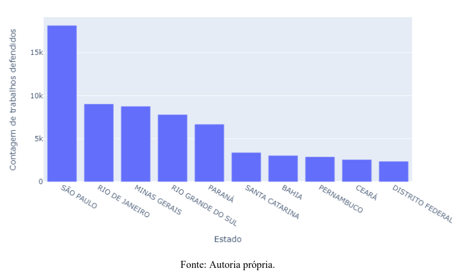
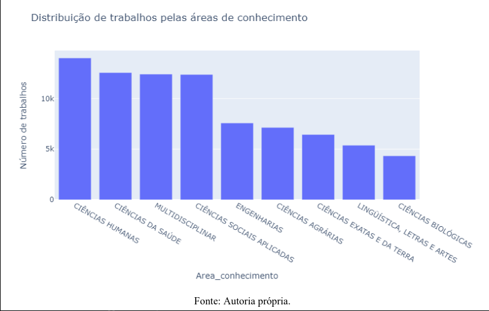

Os gráficos de barras são uma das formas mais eficazes de visualizar e comparar dados entre diferentes categorias. Eles representam informações por meio de barras de altura (ou comprimento) proporcional aos valores que representam, permitindo identificar rapidamente quais categorias possuem valores maiores ou menores.

## 📈 Por que usar gráficos de barras?

Os gráficos de barras são amplamente utilizados em visualizações de dados porque são intuitivos e fáceis de interpretar. Eles permitem que o leitor perceba instantaneamente diferenças entre categorias, facilitando a análise e a tomada de decisões com base em comparações visuais.

- **Comparação direta:** Ideal para comparar dados entre diferentes grupos ou categorias.
- **Clareza:** A simplicidade visual facilita a compreensão para leitores de todos os níveis.
- **Versatilidade:** Pode ser usado na forma vertical (barras verticais) ou horizontal (barras horizontais), dependendo do espaço e do tipo de dados.

## 🛠️ Exemplos e Aplicações

No projeto de análise de pós-graduação, os gráficos de barras foram utilizados para exibir a quantidade de dissertações e teses defendidas em cada estado do Brasil entre 2021 e 2023. Esse gráfico destacou estados com maior produção acadêmica, como São Paulo e Rio de Janeiro, e evidenciou estados com números mais baixos, apontando onde investimentos educacionais podem ser mais necessários.

!!! tip "Como interpretar um gráfico de barras"

O gráfico de barras acima ilustra a distribuição de trabalhos acadêmicos por estado. Barras mais altas representam uma produção maior, enquanto barras menores indicam menor quantidade de publicações.

O gráfico de barras apresenta a distribuição de trabalhos pelas diferentes áreas de conhecimento. Observa-se que a área de Ciências Humanas lidera em quantidade de produções, com mais de 10.000 trabalhos registrados, seguida de perto pelas áreas de Ciências da Saúde e Multidisciplinar. Essas áreas possuem números semelhantes, evidenciando uma forte atividade de pesquisa. Na sequência, temos as áreas de Engenharias e Ciências Sociais Aplicadas, com quantidades também significativas, embora menores em relação às primeiras. As áreas de Ciências Agrárias, Ciências Exatas e da Terra, Linguística, Letras e Artes e Ciências Biológicas possuem menos trabalhos, indicando uma menor proporção de pesquisas publicadas. Esse panorama sugere uma maior concentração de produções acadêmicas em áreas com grande impacto social e humano.

## 📊 Vantagens no Projeto

1. **Identificação de tendências:** Facilita a visualização de quais estados lideram em produção acadêmica e quais precisam de mais incentivo.
2. **Suporte visual para políticas:** Fornece uma base clara para a proposição de políticas públicas, mostrando onde há maior concentração de produção científica.
3. **Fácil compreensão:** Gráficos de barras tornam o conteúdo acessível, inclusive para pessoas que não têm familiaridade com visualização de dados.