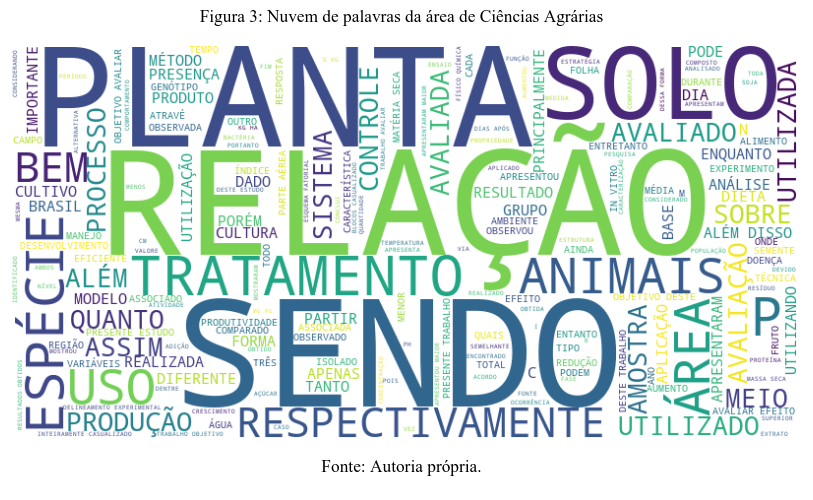
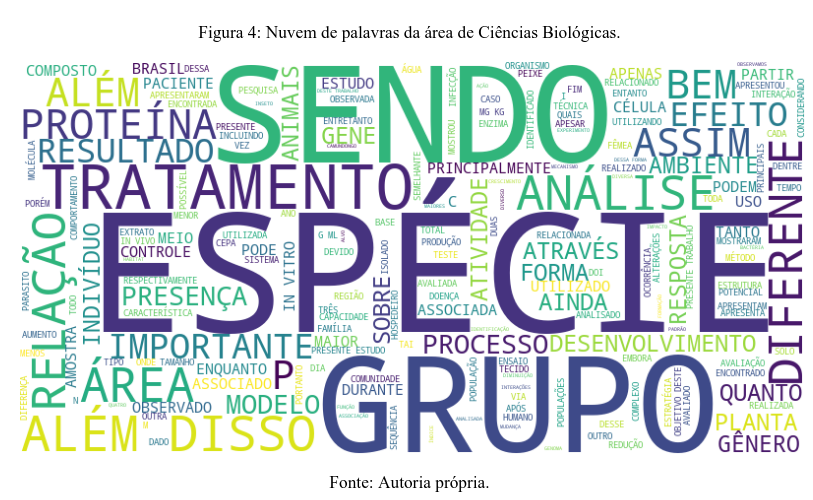
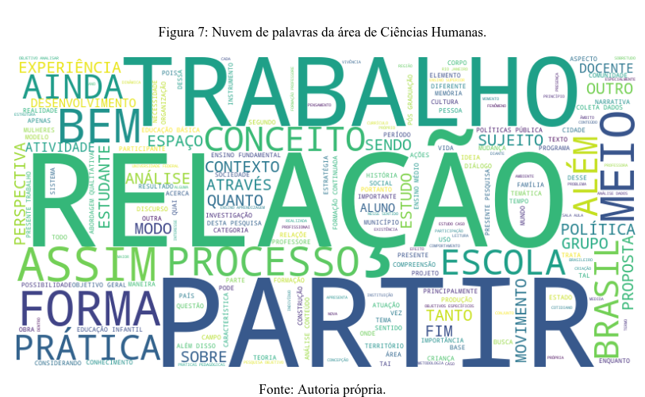
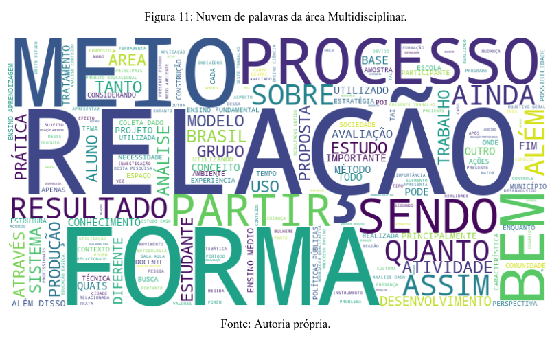

As nuvens de palavras são uma representação visual que destaca a frequência das palavras em um conjunto de dados textuais. Quanto mais vezes uma palavra aparece, maior é o seu tamanho na nuvem. Essa ferramenta é bastante utilizada para fornecer uma visão rápida sobre os termos mais relevantes em um texto, facilitando a identificação de temas principais.

##  Exemplos de Nuvens de Palavras por Área de Conhecimento

!!! example "Nuvem de Palavras - Ciências Agrárias"

Na área de Ciências Agrárias, palavras como "solo", "plantas" e "agricultura" aparecem com destaque, indicando o foco de estudos nessa área. Esses termos refletem temas comuns em pesquisas agrícolas e ecológicas, sendo altamente relevantes para o setor.

!!! example "Nuvem de Palavras - Ciências Biológicas"

Na Ciências Biológicas, palavras como "espécie", "célula", e "proteína" são predominantes, sugerindo uma ênfase em estudos de biologia molecular, genética e ecossistemas. Isso mostra o foco nos aspectos moleculares e na biodiversidade.

!!! example "Nuvem de Palavras - Ciências Humanas"

A nuvem de palavras das Ciências Humanas evidencia termos como "sociedade", "cultura" e "história", destacando o viés cultural e social das pesquisas nessa área, que frequentemente abordam estudos sobre comportamento humano, tradições e políticas sociais.

!!! example "Nuvem de palavras da área Multidisciplinar"

Essas nuvens fornecem uma visão inicial sobre os temas mais abordados em cada área, ajudando a compreender o foco e as abordagens comuns das pesquisas.

## 🧐 Pontos Fracos da Nuvem de Palavras

Apesar de serem visualmente atraentes e fáceis de interpretar, as nuvens de palavras possuem algumas limitações importantes:

1. **Foco Excessivo em Frequência Simples:** Elas mostram apenas a frequência das palavras, sem contextualizar o uso dos termos. Isso pode ser enganoso, pois algumas palavras podem ter múltiplos significados ou não serem tão relevantes quanto parecem.
2. **Palavras Sem Valor Informativo:** Mesmo após a remoção de stopwords (palavras comuns como pronomes e artigos), algumas palavras sem valor específico para o tema podem permanecer. Isso acontece porque, em textos acadêmicos, termos como "análise" e "estudo" aparecem com frequência, mas não informam sobre o conteúdo específico.
3. **Falta de Conexões Contextuais:** A nuvem de palavras não mostra relações entre os termos, o que pode dificultar a compreensão das correlações ou dos tópicos explorados. Palavras podem aparecer grandes apenas pela repetição, sem que estejam diretamente conectadas aos temas principais.
4. **Imprecisão em Análises Profundas:** Para análises detalhadas e inferências específicas, as nuvens de palavras são limitadas, pois não trazem informações quantitativas precisas e contextuais.

## Conclusão

As nuvens de palavras são um bom ponto de partida para explorar temas gerais em conjuntos de dados textuais, mas devem ser complementadas por análises mais profundas. Elas funcionam melhor como uma visualização descritiva, permitindo uma visão ampla, mas não explicativa, das áreas de conhecimento.
